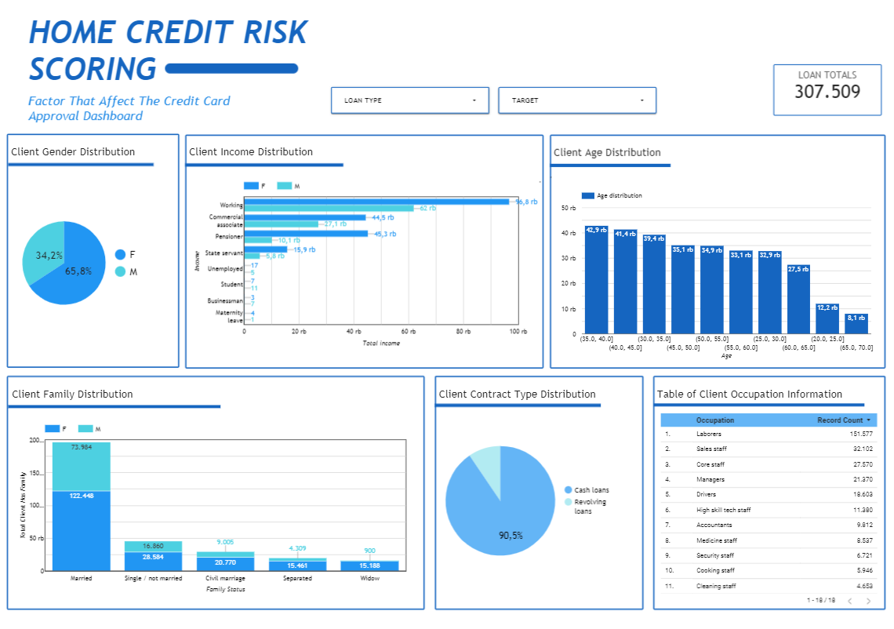
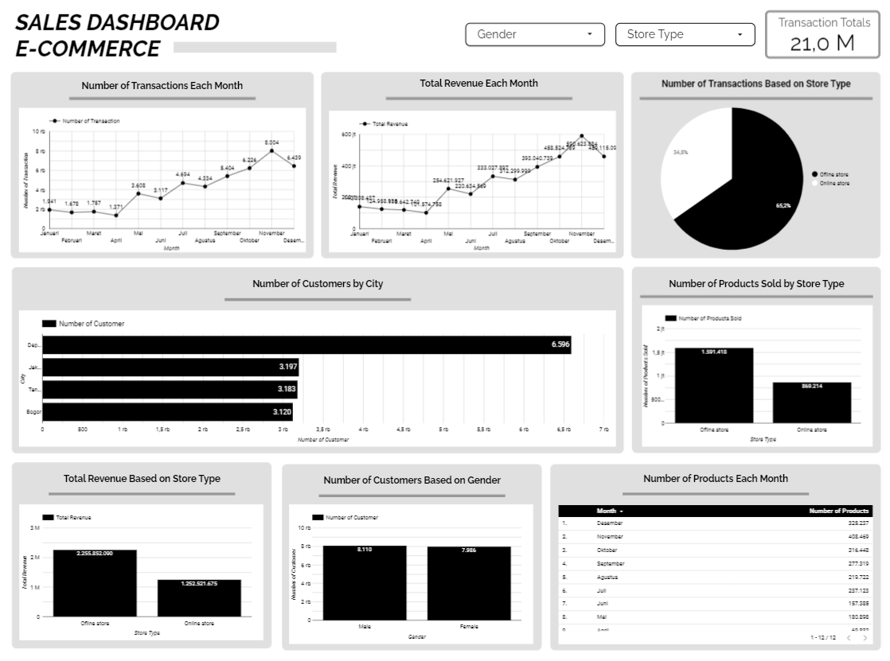

# Portfolio

---

## DATA SCIENCE 

### Home Credit Risk Scoring: Predicting Loan Default with Machine Learning (Team)
{:target="_blank"}
{:target="_blank"}

    <strong>Objective:</strong>
         
        Many people want to get a financial loan to be able to meet their daily needs. Therefore, Home Credit seeks to facilitate financial loans for people who do not have a bank account. The current problem is, Home Credit wants the client data they have to be used as a prediction whether they are able to pay back the money they have lent within a predetermined time, or vice versa. The data to be used is train data. In the data train there is a "Target" variable where the values ​​0 and 1 are the differentiator: If the client can pay according to the due date or can pay on time, then it is marked with 0. If the client has difficulty paying the loan that has been given, it is marked with 1. The To Do is predict the characteristics of clients who have difficulty repaying loans provided by the company's cash flow.
         
     

    
     
     
    
     
     
    
     
        

        <iframe loading="lazy" style="position: absolute; width: 100%; height: 100%; top: 0; left: 0; border: none; padding: 0;margin: 0;"
            src="https://www.canva.com/design/DAFk9d8xLGs/slRNCkJDGoriF2VG-4QXlg/view?embed" allowfullscreen="allowfullscreen" allow="fullscreen">
        </iframe>
        

---

### Prediction of House Prices
{:target="_blank"}

    <strong>Objective:</strong>
         
        Many people are interested in buying or selling a home and want to know the fair market price for the property. Therefore, the purpose of the house prices dataset is to predict house prices based on the features associated with the house. The "SalePrice" variable in the train dataset becomes the target variable to be predicted.
         
     

    
     
     
    
     

---

## Data Analysis

### Data Analysis with DVDRental Dataset

    <strong>Objective:</strong>
         
        Using the DVDRental dataset, there are several questions as attached on the slide below and the results of the analysis using SQL Query on the PostgreSQL software
         
     

        

        <iframe loading="lazy" style="position: absolute; width: 100%; height: 100%; top: 0; left: 0; border: none; padding: 0;margin: 0;"
            src="https://www.canva.com/design/DAFjCg831nk/a9fJcknOuG3crLAFpbyStQ/view?embed" allowfullscreen="allowfullscreen" allow="fullscreen">
        </iframe>
        

---

## Dashboard

### COVID-19 Global Dashboard
{:target="_blank"}
{:target="_blank"}

    <strong>Objective:</strong>
         
        Provide an accurate and up-to-date analysis of the Covid-19 pandemic on a global scale. The dashboard aims to forecast and track the spread of the virus, monitor key statistics, and provide valuable insights for policymakers, healthcare professionals, and the general public.
         
     

    
     
     

---

### E-Commers Sale Dashboard
{:target="_blank"}

    <strong>Objective:</strong>
         
       Provide a concise and comprehensive overview of the sales performance of an online store. The dashboard aims to present key metrics and insights that enable business owners and managers to make informed decisions and drive strategic initiatives. By aggregating and visualizing data from various sources, the dashboard will display real-time information on sales revenue, conversion rates, order volume, customer acquisition, and average order value. It will also include comparative data such as year-over-year growth, top-selling products, and customer segmentation. The ultimate goal of the E-Commerce Sale Dashboard is to empower stakeholders with actionable insights that facilitate effective sales management, optimize marketing efforts, and maximize revenue generation in the rapidly evolving digital marketplace.
         
     

    
     
     

---

## WEBSITE DESIGN

### A Sneaker Recommendation Website: GetSneakers
{:target="_blank"}

    <strong>Objective:</strong>
         
        GET SNEAKERS WEBSITE is a website design that contains sneakers recommendations for men, women, and children. This website has several shoe brand recommendations, namely Nike, Adidas, Converse, and Fila. Apart from that, this website also has a "Contact Us" page so that users can give their opinion about sneakers.
         
     

    
     
     
    
     
     
    
     
     
    
     
     
    
     
     
    
     

---

## Research

### Mobile-Based Learning Application for Junior High Scool Level "MATH EDU" Using Agile Method
{:target="_blank"}

    <strong>Abstract:</strong>
         
       Towards  society  5.0  all  activities  become  more  dominant  in  the  eraof  digitalization.  The  amount  of  material  that  is carried for students but is constrained by time constraints at school makes it difficult to repeat the material individually.Due  to  the  anxiety  of  students  who  find  it  difficult  to  get  complete  material  in  their  review,  we  made  this  mobile application.  The  system  concept  in  this  mobile  application  is  that  students  can  access  materials  online  and  offline, download  subject  matter  in  the  application,  take  tests  that  have  been  provided  by  the  administrator,  and  conduct discussions in the  forums available  in the  application. The modeling used in the preparation of this application is the agile method. In accordance with the goal, namely to provide convenience to junior high school students, the output and results of the design and development of this mobile application are to become a new container and means of learning.
         
         
        Original Title (in Indonesian): Pengembangan Aplikasi Belajar Jenjang SMP MATH EDU Berbasis Mobile dengan Metode Agile
         
     

    
     
     

---

## Certification

---

